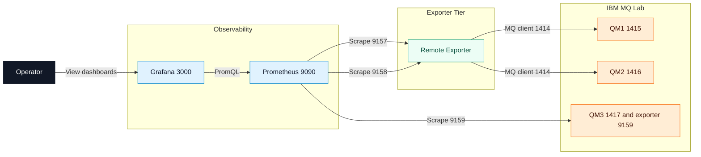

# IBM MQ Metrics Exporter for Prometheus

[](https://www.apache.org/licenses/LICENSE-2.0)
[](https://isocpp.org/)
[](https://cmake.org/)
[](https://www.docker.com/)
[](https://prometheus.io/)
[](https://www.ibm.com/products/mq)

A Prometheus exporter for IBM MQ queue managers, written in C++. Collects metrics from queue managers running on any platform (Windows, Linux, AIX, z/OS, IBM MQ Appliance) via binding mode or client connections.

## Document scope

This document defines how to build, deploy, operate, and troubleshoot the IBM MQ metrics exporter in two supported modes:

- Native binary mode.
- Fixed Docker lab mode with three queue managers.

This document also defines the supported container topology for the lab environment and the expected operational checks.

## Intended audience

- Platform engineers running IBM MQ in containerized environments.
- SRE and operations teams integrating IBM MQ telemetry with Prometheus.
- Developers validating exporter behavior before production rollout.

## Assumptions and prerequisites

- Docker Engine with Docker Compose v2 is installed and operational.
- Host system includes curl and rg for validation steps.
- Ports 1415-1417, 3000, 9090, and 9157-9159 are available on the host.
- You have permission to run Docker and any required sudo operations.

## Reference architecture

The Docker lab is a fixed deployment with three queue managers and mixed exporter models.



## Deployment model

- qm1 and qm2 are monitored by the remote exporter container.
- qm3 is monitored by an exporter process running inside the qm3 container.
- All MQ lab images receive the same freshly built `ibmmq-exporter` binary from the shared exporter artifact image.
- Prometheus scrapes three metrics endpoints:
  - 9157 for QM1 via remote exporter
  - 9158 for QM2 via remote exporter
  - 9159 for QM3 via embedded exporter
- Grafana (optional) queries Prometheus for dashboard visualization on port 3000.

## Features

- **Queue metrics**: depth, high watermark, enqueue/dequeue counts, open handles
- **Channel status**: running/stopped state (with simplified 0-3 status value), messages transferred, bytes sent/received
- **Topic and subscription status**: publisher/subscriber counts, durable subscriptions
- **Queue manager status**: operational state, connection count, CHINIT status
- **Cluster status**: cluster queue manager state and type
- **Resource monitoring**: CPU, memory, and disk utilization metrics from queue manager
- **Statistics/Accounting**: per-application and per-queue MQI operation counts from statistics messages
- **z/OS metrics**: buffer pool and page set utilization
- **Publication metrics**: exact topic subscriptions for resource monitoring classes (CPU/DISK/STATMQI/STATQ)
- **Reconnection**: survives queue manager restarts, reports `qmgr_status=0` while disconnected
- **Dynamic discovery**: periodically rediscovers queues and channels matching patterns, filters out model/temporary queues
- **Grafana dashboards**: 7 pre-built dashboards for channels, queues, topics, QM status, z/OS, and overview
- **Cross-platform**: builds on Windows, Linux, macOS; connects to MQ on any supported platform
- **Container-ready**: multi-stage Dockerfile included
- **Queue leak prevention**: automatic cleanup of temporary dynamic queues after PCF commands and subscriptions

## Quick start

This section provides two supported paths:

- Native build and run (single exporter process).
- Docker lab deployment (fixed topology with qm1, qm2, qm3).

### Versioning

`VERSION` is the single source of truth for the exporter base version. Every CMake build stamps the binary with `base+git-sha[.dirty]` plus separate build-time metadata, and that same version is reported by:

```bash
./build/ibmmq-exporter --version
./build/ibmmq-exporter version
```

The `ibmmq_collection_info` Prometheus metric exposes the exact build stamp in the `collector_version` label. Docker build scripts pass the base version into image labels/tags automatically; use `./scripts/version_report.sh` to compare the repo, Docker images, and running containers.

### Prerequisites

- Optional pre-prerequisite for real IBM MQ builds: download the IBM MQ C Redistributable package (includes headers under `inc/`) from IBM Fix Central:
  https://www.ibm.com/support/fixcentral/swg/quickorder?parent=ibm%7EWebSphere&product=ibm/WebSphere/WebSphere+MQ&release=10.0.0.0&platform=All&function=fixId&fixids=10.0.0.0-IBM-MQC-Redist-LinuxX64&includeRequisites=0&includeSupersedes=0&downloadMethod=http&source=fc
- CMake 3.20+
- C++20 compiler (GCC 11+, Clang 14+, MSVC 2022+)
- IBM MQ client libraries (optional; stub mode available for building without MQ)

### Build

```bash
# With real IBM MQ client libraries
cmake -S . -B build
cmake --build build

# Without IBM MQ (stub mode for development/testing)
cmake -S . -B build -DIBMMQ_EXPORTER_USE_STUB_MQ=ON
cmake --build build
```

### Run

```bash
# Generate a sample configuration file
./build/ibmmq-exporter config generate > config.yaml

# Edit config.yaml with your queue manager details, then:
./build/ibmmq-exporter -c config.yaml --continuous

# Metrics available at http://localhost:9091/metrics
```

## Docker lab deployment (recommended)

### Topology summary

The Docker lab is intentionally fixed to three queue managers and one Prometheus instance, with optional Grafana:

- qm1: IBM MQ queue manager container built from the shared monitoring image.
- qm2: IBM MQ queue manager container built from the shared monitoring image.
- qm3: IBM MQ queue manager container with embedded ibmmq-exporter.
- exporter: remote exporter container that targets qm1 and qm2.
- prometheus-local-monitoring: Prometheus container that scrapes ports 9157, 9158, and 9159.
- grafana-local-monitoring (optional): Grafana container that queries Prometheus and auto-loads dashboards.

### Port allocation

| Component | Purpose | Host Port |
|---|---|---|
| qm1 | MQ listener | 1415 |
| qm2 | MQ listener | 1416 |
| qm3 | MQ listener | 1417 |
| exporter QM1 | Metrics endpoint | 9157 |
| exporter QM2 | Metrics endpoint | 9158 |
| qm3 embedded exporter | Metrics endpoint | 9159 |
| Prometheus UI | Web UI | 9090 |
| Grafana UI (optional) | Dashboard UI | 3000 |

### Deploy the lab

Run the following commands from the repository root.

```bash
cd docker_build

# Builds the exporter artifact, MQ images, and fixed lab set: qm1, qm2, qm3
./build_mq.sh

# Builds and starts remote exporter for qm1 and qm2 on ports 9157 and 9158
./build_remote_exporter.sh

# Builds and starts Prometheus scraping merged remote + qm3 endpoints
./build_prometheus.sh -h host.docker.internal -p 9157,9158,9159 -P 9090

# Optional: builds and starts Grafana with Prometheus datasource + dashboards
./build_grafana.sh
```

Important

- `./build_mq.sh` does not take a queue manager count parameter.
- The script always provisions qm1, qm2, and qm3.
- The script builds `mq-remote-exporter:latest` first, then `mq-local-monitoring:latest`, then `mq-local-embedded-exporter:latest`.
- qm1, qm2, and qm3 all contain the same exporter binary; qm3 also runs it as an embedded MQ service.
- Run `./scripts/version_report.sh` from the repository root to compare the repo version, Docker image labels, image binaries, and running container binaries.

## Operations runbook

### Start or rebuild the full lab

```bash
cd docker_build
./build_mq.sh
./build_remote_exporter.sh
./build_prometheus.sh -h host.docker.internal -p 9157,9158,9159 -P 9090
./build_grafana.sh
```

### Verify runtime health

```bash
docker ps --format 'table {{.Names}}\t{{.Status}}\t{{.Ports}}'
curl -s http://localhost:9090/api/v1/targets
curl -s http://localhost:3000/api/health
```

### Verify per-queue-manager metrics endpoints

```bash
curl -s http://localhost:9157/metrics | rg -m 1 'qmgr="QM1"'
curl -s http://localhost:9158/metrics | rg -m 1 'qmgr="QM2"'
curl -s http://localhost:9159/metrics | rg -m 1 'qmgr="QM3"'
```

### Stop the lab

```bash
cd docker_build
docker compose -p mq_local_monitoring -f docker-compose.yml down
docker compose -f docker-compose.remote-exporter.yml down
docker compose -p prometheus_local_monitoring -f docker-compose.prometheus.yml down
docker compose -p grafana_local_monitoring -f docker-compose.grafana.yml down
```

### Validate the deployment

```bash
# Container health and port mappings
docker ps --format 'table {{.Names}}\t{{.Status}}\t{{.Ports}}'

# Metrics checks
curl -s http://localhost:9157/metrics | rg -m 1 'qmgr="QM1"'
curl -s http://localhost:9158/metrics | rg -m 1 'qmgr="QM2"'
curl -s http://localhost:9159/metrics | rg -m 1 'qmgr="QM3"'

# Prometheus targets
curl -s http://localhost:9090/api/v1/targets
```

### Operational notes

- qm3 uses an embedded exporter model and publishes metrics directly on port 9159.
- qm1 and qm2 are scraped through the dedicated remote exporter container.
- The remote exporter exposes one exporter endpoint per target: QM1 on 9157 and QM2 on 9158.
- If resource-monitoring publication metrics are missing, enable MONQ and MONCHL on each queue manager.

## Troubleshooting matrix

| Symptom | Likely Cause | Resolution |
|---|---|---|
| qm containers restart repeatedly | Invalid MQSC or unsupported object attributes | Check container logs and validate mq-monitoring MQSC content, then rebuild with build_mq.sh |
| Prometheus target shows down or unknown | Missing target port in Prometheus config or exporter not listening | Re-run build_prometheus.sh with -p 9157,9158,9159 and verify exporter logs |
| 9159 metrics endpoint not reachable | qm3 still initializing or embedded exporter not started | Check qm3 logs, wait for healthy status, then retry curl against localhost:9159/metrics |
| qmgr labels missing in metrics | Exporter unable to connect to MQ target | Validate channel, host, and port mapping for target queue manager |
| Missing resource metrics (CPU, memory, disk) | Queue manager monitoring classes not enabled | Run ALTER QMGR MONQ(MEDIUM) MONCHL(MEDIUM) and restart queue manager |
| build_mq.sh prompts repeatedly for sudo | Privileged filesystem operations require authentication | Run sudo -v before invoking build scripts to cache credentials |

## Configuration

Configuration is via YAML file with environment variable overrides.

### Environment variables

| Variable | Description |
|---|---|
| `IBMMQ_QUEUE_MANAGER` | Queue manager name |
| `IBMMQ_TARGETS` | Remote mode multi-target list (`QM@host:port` comma-separated) |
| `IBMMQ_CHANNEL` | Channel name |
| `IBMMQ_CONNECTION_NAME` | Connection name (`host(port)`) |
| `IBMMQ_USER` | Authentication user |
| `IBMMQ_PASSWORD` | Authentication password |

Remote-exporter note:
- `configs/config.collector.yaml` is a single-queue-manager schema.
- Multi-queue-manager remote scraping is configured with `IBMMQ_TARGETS`.
- The remote-exporter runtime starts one exporter process per target and exposes public endpoints on `9157` for QM1 and `9158` for QM2.

### Configuration file

Generate a full configuration template:

```bash
./build/ibmmq-exporter config generate
```

See `configs/config.collector.yaml` for a fully documented configuration file with all available options.

Key configuration sections:

- **mq**: Connection parameters (queue manager, channel, host, port, TLS)
- **collector**: Collection behavior (interval, patterns, status polling, reconnection)
- **prometheus**: HTTP server (port, path, namespace, TLS)
- **metadata**: Extra labels added to every metric
- **logging**: Log level, format, output file

### Connection modes

**Client mode** (remote queue manager):
```yaml
mq:
  queue_manager: "QM1"
  channel: "APP.SVRCONN"
  host: "mq-server.example.com"
  port: 1414
```

**Binding mode** (local queue manager):
```yaml
mq:
  queue_manager: "QM1"
  # Leave channel, host, and port empty for binding mode
```

### Monitored object patterns

```yaml
collector:
  monitored_queues:
    - "APP.*"        # All queues starting with APP.
    - "!SYSTEM.*"    # Exclude system queues
  monitored_channels:
    - "*"            # All channels
  monitored_topics:
    - "#"            # All topics
```

### Resource monitoring (CPU/memory/disk metrics)

To collect CPU, memory, and disk utilization metrics from your queue manager, enable resource monitoring:

```bash
# On the queue manager, enable resource monitoring:
ALTER QMGR MONQ(MEDIUM) MONCHL(MEDIUM)

# Then restart the queue manager
```

**Note:** This is different from `STATMQI(ON)` and `STATQ(ON)` which enable statistics messages to admin queues. Both are independent features.

After you enable resource monitoring, the exporter discovers and collects:
- CPU and RAM metrics (`ibmmq_qmgr_*cpu*`, `ibmmq_qmgr_ram_*`)
- Queue manager and MQ filesystem metrics (`ibmmq_qmgr_*file_system_*`)
- Log usage and latency metrics (`ibmmq_qmgr_log_*`)
- Per-queue publication metrics from STATQ class

To verify that resource monitoring is working:
1. Look for log messages: `"Found monitor class 'CPU'"`, `"Found monitor class 'DISK'"`
2. Check metrics output for `ibmmq_qmgr_cpu_*` and related metrics
3. If discovery fails, run the `ALTER QMGR` command above and restart the queue manager

## Metrics

All metrics use the configured namespace (default: `ibmmq`).

### Queue metrics

| Metric | Labels | Description |
|---|---|---|
| `ibmmq_queue_depth` | qmgr, platform, queue | Current queue depth |
| `ibmmq_queue_high_depth` | qmgr, platform, queue | High watermark depth |
| `ibmmq_queue_enqueue_count` | qmgr, platform, queue | Messages enqueued |
| `ibmmq_queue_dequeue_count` | qmgr, platform, queue | Messages dequeued |
| `ibmmq_queue_input_handles` | qmgr, platform, queue | Open input handles |
| `ibmmq_queue_output_handles` | qmgr, platform, queue | Open output handles |

### Channel status metrics

| Metric | Labels | Description |
|---|---|---|
| `ibmmq_channel_status` | qmgr, platform, channel, type, connname, rqmname | Raw IBM MQ channel status code, such as `3` for running |
| `ibmmq_channel_status_squash` | qmgr, platform, channel, type, connname, rqmname | Simplified channel status (0=OK, 1=transitioning, 2=stopped, 3=unknown) |
| `ibmmq_channel_msgs` | qmgr, platform, channel, type | Messages transferred |
| `ibmmq_channel_bytes_sent` | qmgr, platform, channel, type | Bytes sent |
| `ibmmq_channel_bytes_received` | qmgr, platform, channel, type | Bytes received |

### Queue manager status metrics

| Metric | Labels | Description |
|---|---|---|
| `ibmmq_qmgr_status` | qmgr, platform | Queue manager status (0=unavailable/disconnected, 1=starting, 2=running, 3=quiescing, 4=standby) |
| `ibmmq_qmgr_connection_count` | qmgr, platform | Active connections |
| `ibmmq_qmgr_channel_initiator_status` | qmgr, platform | Channel initiator status (0=stopped, 1=starting, 2=running, 3=stopping, 4=retrying) |
| `ibmmq_qmgr_command_server_status` | qmgr, platform | Command server status (0=stopped, 1=starting, 2=running, 3=stopping) |

### Topic and subscription metrics

| Metric | Labels | Description |
|---|---|---|
| `ibmmq_topic_pub_count` | qmgr, platform, topic | Publisher count |
| `ibmmq_topic_sub_count` | qmgr, platform, topic | Subscriber count |
| `ibmmq_sub_durable` | qmgr, platform, subscription, topic | Durable flag |
| `ibmmq_sub_type` | qmgr, platform, subscription, topic | Subscription type |

### Resource monitoring metrics (CPU, memory, disk)

When resource monitoring is enabled on the queue manager, metrics are collected via publication subscriptions. Metric names are derived from IBM MQ monitor element descriptions, so the exact set varies by platform and queue manager configuration.

| Metric | Class | Description |
|---|---|---|
| `ibmmq_qmgr_system_cpu_time_percentage` | CPU | System CPU percentage |
| `ibmmq_qmgr_cpu_load_one_minute_average` | CPU | One-minute CPU load average |
| `ibmmq_qmgr_ram_free_percentage` | CPU | Available RAM percentage reported by MQ resource monitoring |
| `ibmmq_qmgr_mq_errors_file_system_free_space` | DISK | MQ errors filesystem free-space percentage |
| `ibmmq_qmgr_queue_manager_file_system_free_space` | DISK | Queue manager filesystem free-space percentage |
| `ibmmq_qmgr_log_write_latency` | DISK | Log write latency |
| `ibmmq_qmgr_log_slowest_write_since_restart` | DISK | Slowest log write since queue manager restart |

### Statistics metrics (STATMQI, per application)

Application-level MQI statistics from `SYSTEM.ADMIN.STATISTICS.QUEUE`:

| Metric | Description |
|---|---|
| `ibmmq_statmqi_put_messages` | Messages put by application |
| `ibmmq_statmqi_get_messages` | Messages gotten by application |
| `ibmmq_statmqi_subscribe_count` | Active subscriptions |
| `ibmmq_statmqi_publish_count` | Messages published |
| `ibmmq_statmqi_connect_count` | New connections |
| `ibmmq_statmqi_disconnect_count` | Disconnects |

### Per-queue statistics metrics (STATQ)

| Metric | Description |
|---|---|
| `ibmmq_statq_put_messages` | Messages put to queue |
| `ibmmq_statq_get_messages` | Messages gotten from queue |
| `ibmmq_statq_open_input` | Open input operations |
| `ibmmq_statq_open_output` | Open output operations |
| `ibmmq_statq_synced_put` | Synced message puts |
| `ibmmq_statq_synced_get` | Synced message gets |

### z/OS metrics

| Metric | Labels | Description |
|---|---|---|
| `ibmmq_usage_bp_free_buffers` | qmgr, platform, bufferpool | Free buffers |
| `ibmmq_usage_bp_total_buffers` | qmgr, platform, bufferpool | Total buffers |
| `ibmmq_usage_ps_total_pages` | qmgr, platform, pageset | Total pages |
| `ibmmq_usage_ps_unused_pages` | qmgr, platform, pageset | Unused pages |

## Grafana dashboards

Pre-built dashboards are in the `dashboards/` directory:

| Dashboard | Description |
|---|---|
| `MQ_Prometheus_Overview.json` | Overview: queue activity, CPU, log latency, channels |
| `Queue_Status.json` | Per-queue depth, message rates, response times |
| `Channel_Status.json` | Channel status, bytes, messages, network timing |
| `Queue_Manager_Status.json` | QM status, connections, cluster, Native HA |
| `Topic_Status.json` | Topic and subscription monitoring |
| `zOS_Status.json` | z/OS buffer pools, page sets |
| `Logging.json` | HA replica and CRR recovery metrics |

To run Grafana locally with automatic Prometheus datasource provisioning and
auto-import of dashboards:

```bash
cd docker_build
./build_grafana.sh
```

Default Grafana endpoint: `http://localhost:3000` (login: `admin` / `admin`).
The script copies `../dashboards/*.json` into `docker_build/grafana/dashboards/`
for provisioning on startup.

## MQ service integration

To run the exporter as an MQ service (auto-start and auto-stop with the queue manager):

```bash
# Install binary
sudo cp build/ibmmq-exporter /usr/local/bin/ibmmq-exporter/
sudo cp scripts/ibmmq_exporter.sh /usr/local/bin/ibmmq-exporter/
sudo cp configs/config.collector.yaml /usr/local/bin/ibmmq-exporter/config.yaml

# Define MQ service
runmqsc QM1 < scripts/ibmmq_exporter.mqsc
```

## Build options

| CMake Option | Default | Description |
|---|---|---|
| `IBMMQ_EXPORTER_USE_STUB_MQ` | OFF | Build without real MQ libraries |
| `IBMMQ_EXPORTER_ENABLE_TLS` | OFF | Enable TLS for metrics endpoint (requires OpenSSL) |
| `MQ_HOME` | auto-detect | Path to IBM MQ installation |

## CLI reference

```
ibmmq-exporter [OPTIONS] [SUBCOMMAND]

Options:
  -c, --config       Configuration file path
  -v, --verbose      Enable verbose logging
  --log-level        Log level (debug, info, warn, error)
  --log-format       Log format (json, text)
  --continuous       Run continuous monitoring
  --interval         Collection interval in seconds
  --max-cycles       Maximum collection cycles (0=infinite)
  --reset-stats      Reset statistics after reading
  --prometheus-port  Prometheus HTTP port

Subcommands:
  version            Print version information
  test               Test IBM MQ connection
  config generate    Generate sample configuration
  config validate    Validate configuration file
```

## License

See [LICENSE](LICENSE) for details.
